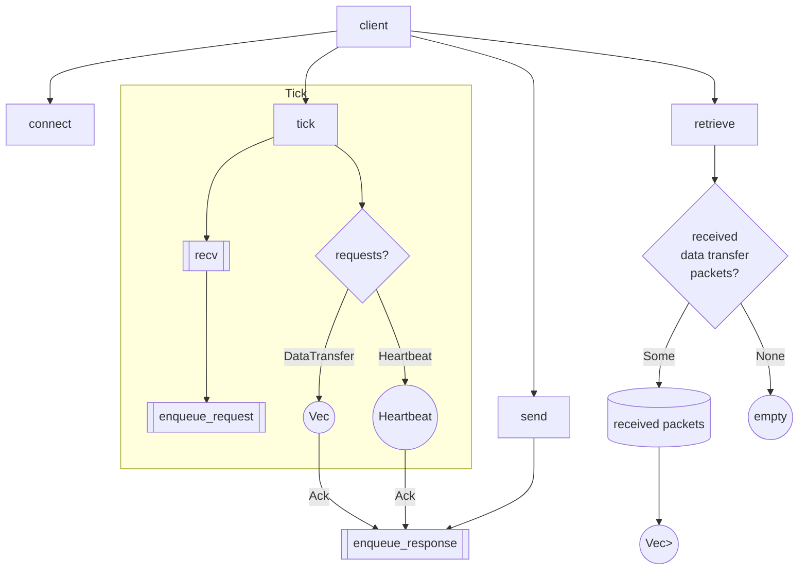
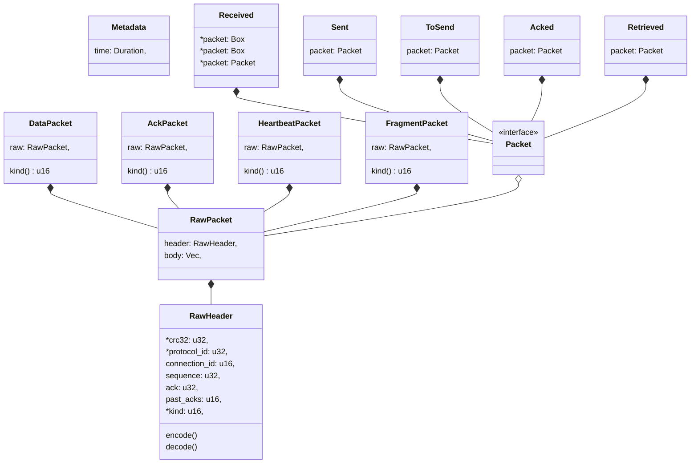

# Antarc UDP protocol

**Client**:





**Server**:

```rust
let mut players = PlayerClients::new(4);
let mut server_manager = Antarc::new(Server);
server_manager.listen();

// TODO(alex) 2021-01-26: Should we have a `dispatch` and treat `send`, `broadcast` and so on as
// enqueue operations (not immediately executed)? Like having a `server_manager.update()` function
// that goes into each host sending the packets that are queued.
loop {
    let (&data, &from) = server_manager.recv().await;
    if from.id == players[1].id && players[1].is_out_of_sync() {
        let game_state = game_manager.full_state();
        let _ = server_manager.send(SyncPlayer(game_state), from)?;
    } else {
        let _ = server_manager.broadcast(PlayerShot(players[1]))?;
    }
}
```
