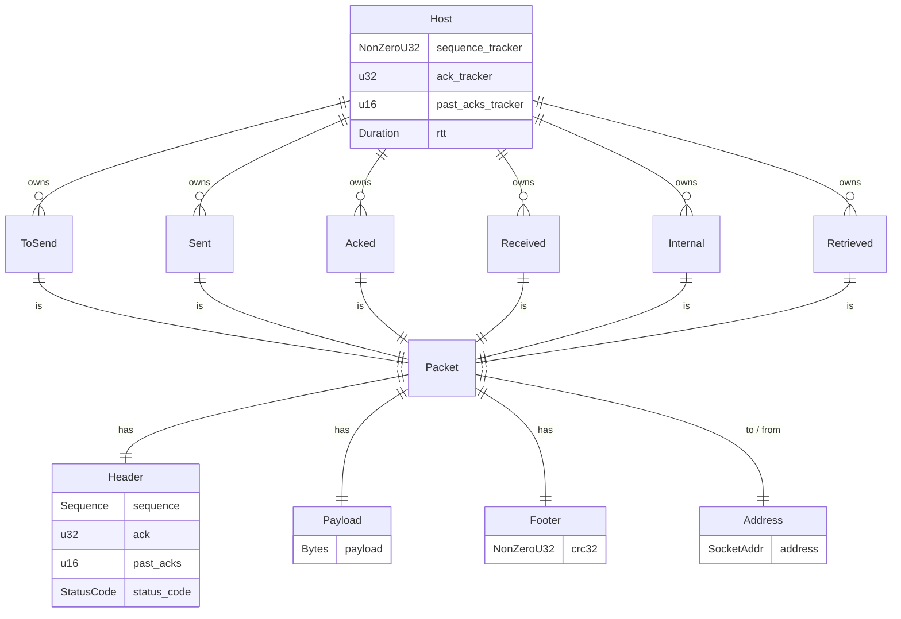

# Entity diagram

- TODO(alex) 2021-03-23: How do I send data to some address? We're lacking an address here
  to identify both whom `ToSend` and `Received` from whom. There must be a way to relate a `Host`
  and its packets (both sending and receiving).

