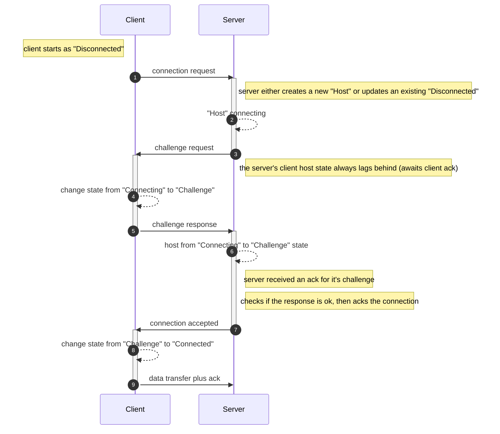
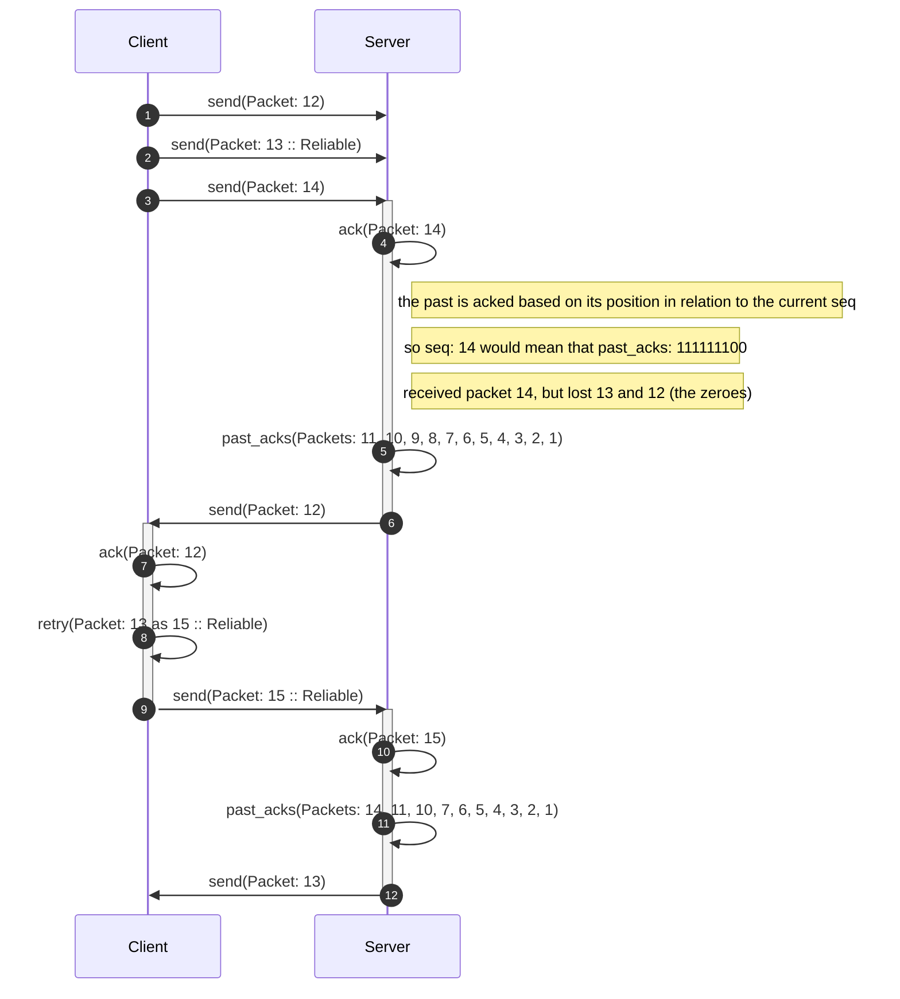

# Sequence diagram ideas

## client server

```mermaid
sequenceDiagram
    autonumber

    Note left of Client : client starts as "Disconnected"
    Client ->> Server : connection request
    activate Server
    Note right of Server : server either creates a new "Host" or updates an existing "Disconnected"
    Server -->> Server : "Host" connecting
    Server ->> Client : challenge request
    deactivate Server
    activate Client
    Note right of Server : the server's client host state always lags behind (awaits client ack)

    Client -->> Client : change state from "Connecting" to "Challenge"
    Client ->> Server : challenge response
    deactivate Client

    activate Server
    Server -->> Server : host from "Connecting" to "Challenge" state
    Note right of Server : server received an ack for it's challenge
    Note right of Server : checks if the response is ok, then acks the connection
    Server ->> Client : connection accepted
    deactivate Server

    activate Client
    Client -->> Client : change state from "Challenge" to "Connected"
    Client ->> Server : data transfer plus ack
    deactivate Client
```

## packet ack

```mermaid
sequenceDiagram
    autonumber

    Client ->> Server : send(Packet: 12)
    Client ->> Server : send(Packet: 13 :: Reliable)
    Client ->> Server : send(Packet: 14)

    activate Server
    Server ->> Server : ack(Packet: 14)
    Note right of Server : the past is acked based on its position in relation to the current seq
    Note right of Server : so seq: 14 would mean that past_acks: 111111100
    Note right of Server : received packet 14, but lost 13 and 12 (the zeroes)
    Server ->> Server : past_acks(Packets: 11, 10, 9, 8, 7, 6, 5, 4, 3, 2, 1)
    Server ->> Client : send(Packet: 12)
    deactivate Server

    activate Client
    Client ->> Client : ack(Packet: 12)
    Client ->> Client : retry(Packet: 13 as 15 :: Reliable)
    Client ->> Server : send(Packet: 15 :: Reliable)
    deactivate Client

    activate Server
    Server ->> Server : ack(Packet: 15)
    Server ->> Server : past_acks(Packets: 14, 11, 10, 7, 6, 5, 4, 3, 2, 1)
    Server ->> Client : send(Packet: 13)
    deactivate Server
```
