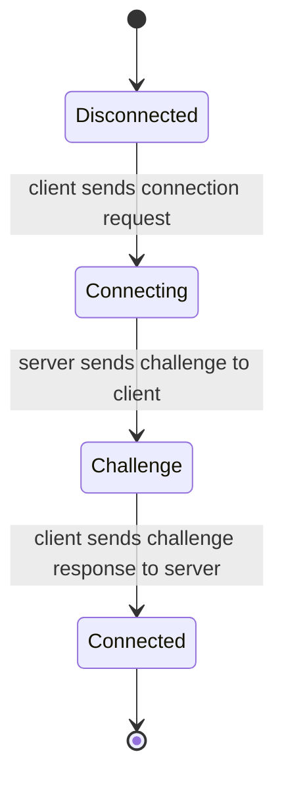
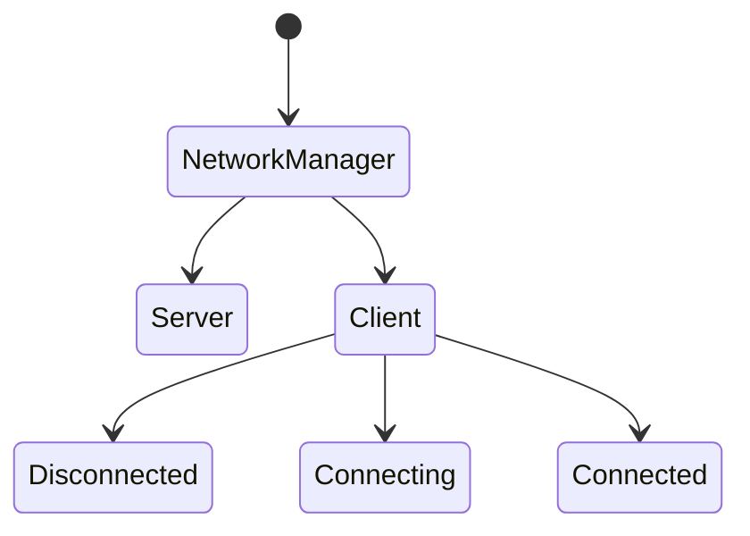

# State diagram ideas

```mermaid
stateDiagram-v2
    [*] --> Disconnected
    Disconnected --> Connecting : client sends connection request
    Connecting --> Challenge : server sends challenge to client
    Challenge --> Connected : client sends challenge response to server
    Connected --> [*]
```

```mermaid
stateDiagram-v2
    [*] --> NetworkManager
    NetworkManager --> Server
    NetworkManager --> Client
    Client --> Disconnected
    Client --> Connecting
    Client --> Connected
```
